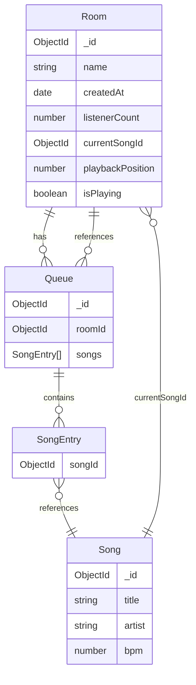

# SoundScape ERD

```mermaid
erDiagram
  Room {
    ObjectId _id
    string name
    date createdAt
    number listenerCount
    ObjectId currentSongId
    number playbackPosition
    boolean isPlaying
  }
  Song {
    ObjectId _id
    string title
    string artist
    number bpm
  }
  Queue {
    ObjectId _id
    ObjectId roomId
    SongEntry[] songs
  }
  SongEntry {
    ObjectId songId
  }

  Room ||--o{ Queue : has
  Queue }o--|| Room : references
  Queue ||--o{ SongEntry : contains
  SongEntry }o--|| Song : references
  Room }o--|| Song : currentSongId
```
